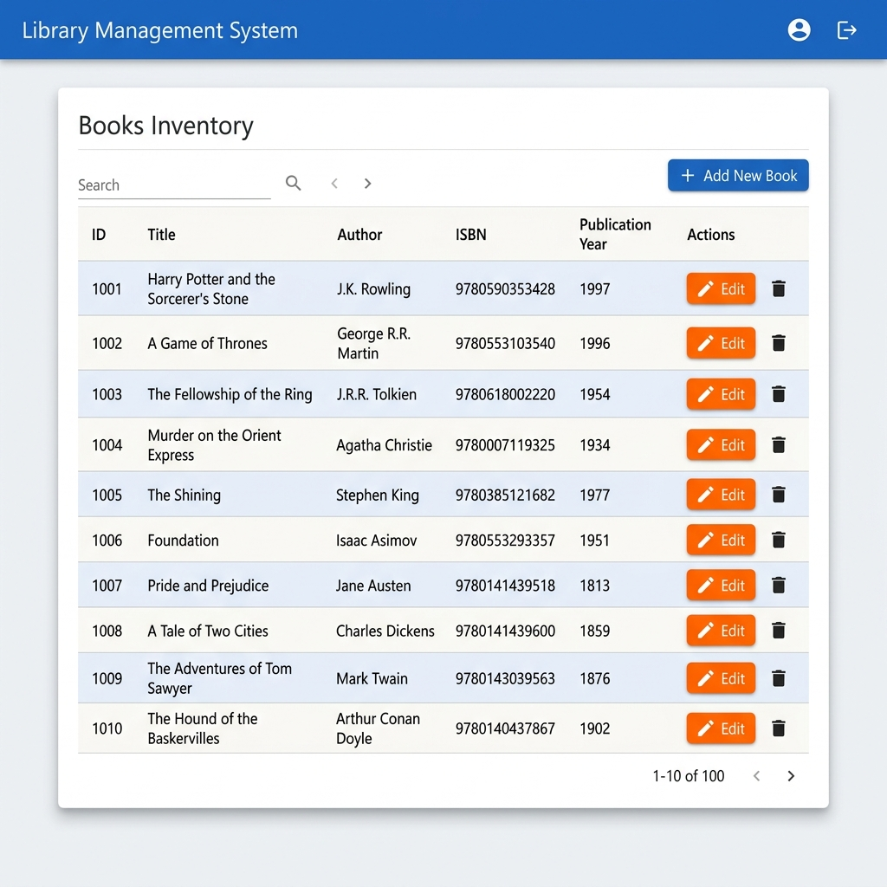
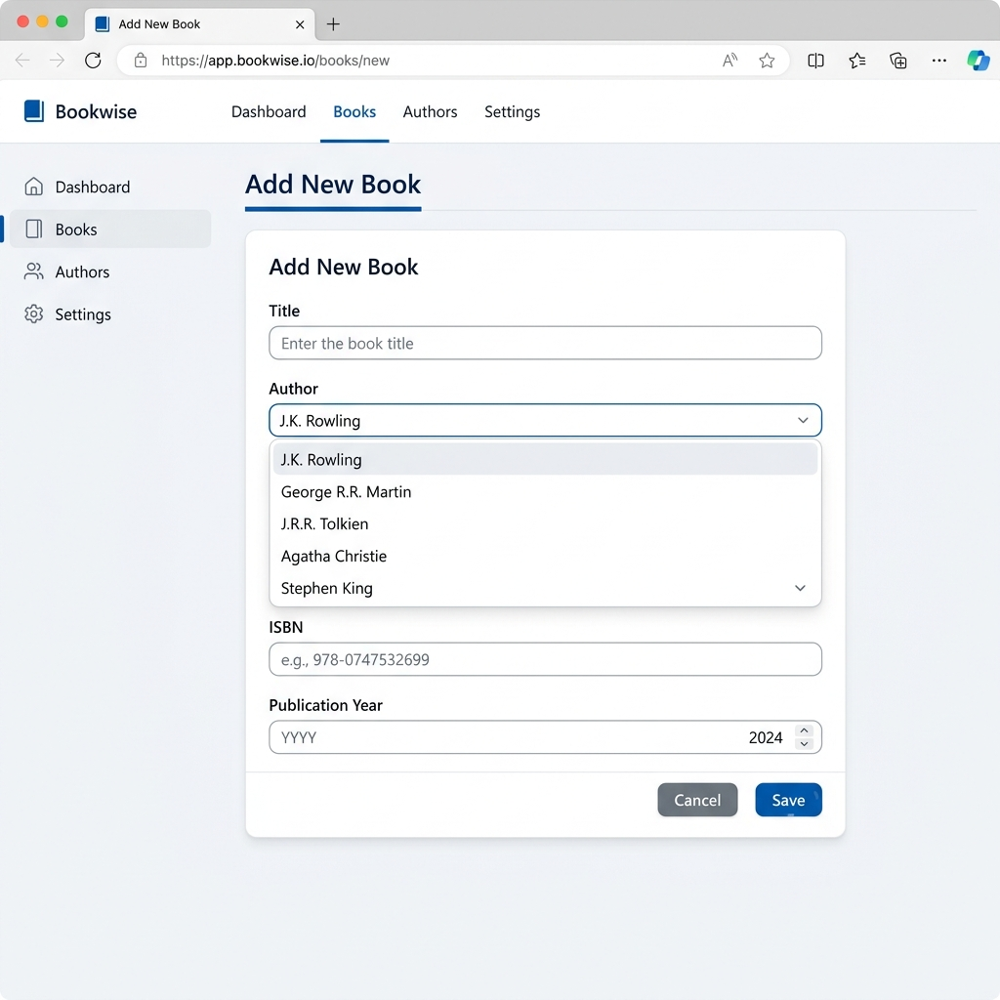
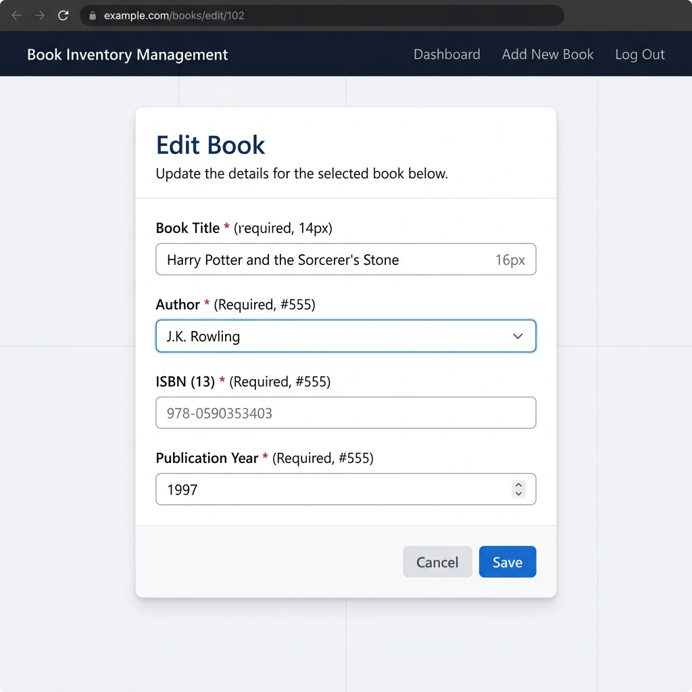

# Spring Boot Library Management Application

## Project Documentation

---

## Table of Contents

1. [Introduction](#1-introduction)
2. [Entity Relationship Design](#2-entity-relationship-design)
3. [Implementation Details](#3-implementation-details)
   - 3.1 [Project Configuration](#31-project-configuration)
   - 3.2 [Entity Layer](#32-entity-layer)
   - 3.3 [Repository Layer](#33-repository-layer)
   - 3.4 [Service Layer](#34-service-layer)
   - 3.5 [Controller Layer](#35-controller-layer)
   - 3.6 [View Layer (JSP)](#36-view-layer-jsp)
4. [CRUD Operations](#4-crud-operations)
   - 4.1 [Populate Database](#41-populate-database)
   - 4.2 [Create Operation](#42-create-operation)
   - 4.3 [Read Operation](#43-read-operation)
   - 4.4 [Update Operation](#44-update-operation)
5. [Testing](#5-testing)
6. [Screenshots](#6-screenshots)
7. [Challenges Faced and Solutions](#7-challenges-faced-and-solutions)
8. [GitHub URL](#8-github-url)

---

## 1. Introduction

This project is a **Library Management System** built using **Spring Boot**. It manages two entities — **Author** and **Book** — and demonstrates core CRUD operations (Create, Read, Update) through a web interface built with JSP pages. The application uses an H2 in-memory database, Spring Data JPA for persistence, and follows a layered architecture with separate Repository, Service, and Controller components.

---

## 2. Entity Relationship Design

### Entities

| Entity   | Attributes                                  |
|----------|---------------------------------------------|
| **Author** | `id` (PK), `name`, `biography`             |
| **Book**   | `id` (PK), `title`, `isbn` (unique), `publicationYear`, `author_id` (FK) |

### Relationship

The relationship between the two entities is **One-to-Many**:

- **One Author** can write **many Books**.
- **Each Book** belongs to exactly **one Author**.

This is implemented using:
- `@OneToMany(mappedBy = "author")` on the `Author` entity.
- `@ManyToOne` with `@JoinColumn(name = "author_id")` on the `Book` entity.

### ER Diagram

```
┌──────────────────────┐          ┌──────────────────────────────┐
│       AUTHORS        │          │            BOOKS             │
├──────────────────────┤          ├──────────────────────────────┤
│ id (PK, BIGINT)      │──┐       │ id (PK, BIGINT)              │
│ name (VARCHAR, NN)   │  │       │ title (VARCHAR, NN)          │
│ biography (VARCHAR)  │  │       │ isbn (VARCHAR, UNIQUE, NN)   │
└──────────────────────┘  │       │ publication_year (INT)       │
                          └──────>│ author_id (FK, BIGINT, NN)   │
                         1    *   └──────────────────────────────┘
```

**Legend:** PK = Primary Key, FK = Foreign Key, NN = Not Null

---

## 3. Implementation Details

### 3.1 Project Configuration

#### `application.properties`

```properties
spring.application.name=library-app

# H2 Database configuration
spring.datasource.url=jdbc:h2:mem:librarydb
spring.datasource.driverClassName=org.h2.Driver
spring.datasource.username=sa
spring.datasource.password=password
spring.jpa.database-platform=org.hibernate.dialect.H2Dialect

# Enable H2 console
spring.h2.console.enabled=true
spring.h2.console.path=/h2-console

# Show SQL queries
spring.jpa.show-sql=true
spring.jpa.properties.hibernate.format_sql=true

# Initialize database schema and data
spring.jpa.hibernate.ddl-auto=create-drop
spring.sql.init.mode=always
spring.jpa.defer-datasource-initialization=true

# JSP View Resolver configuration
spring.mvc.view.prefix=/WEB-INF/jsp/
spring.mvc.view.suffix=.jsp
```

**Key Dependencies** (`pom.xml`):
- `spring-boot-starter-web` — Spring MVC
- `spring-boot-starter-data-jpa` — JPA / Hibernate
- `spring-boot-starter-validation` — Bean Validation
- `h2` — In-memory database
- `tomcat-embed-jasper` — JSP rendering
- `jakarta.servlet.jsp.jstl-api` & `jakarta.servlet.jsp.jstl` — JSTL tag libraries

---

### 3.2 Entity Layer

#### `Author.java`

```java
package com.example.libraryapp.entity;

import jakarta.persistence.*;
import jakarta.validation.constraints.NotBlank;
import java.util.List;

@Entity
@Table(name = "authors")
public class Author {

    @Id
    @GeneratedValue(strategy = GenerationType.IDENTITY)
    private Long id;

    @NotBlank(message = "Name is mandatory")
    @Column(nullable = false)
    private String name;

    @Column(length = 1000)
    private String biography;

    @OneToMany(mappedBy = "author", cascade = CascadeType.ALL, fetch = FetchType.LAZY)
    private List<Book> books;

    // Constructors, Getters, and Setters omitted for brevity
}
```

**Key JPA Annotations Used:**
- `@Entity` — Marks the class as a JPA entity
- `@Table(name = "authors")` — Maps to the `authors` table
- `@Id` / `@GeneratedValue` — Primary key with auto-increment
- `@NotBlank` — Validation constraint
- `@OneToMany(mappedBy = "author")` — Defines the inverse side of the relationship

#### `Book.java`

```java
package com.example.libraryapp.entity;

import jakarta.persistence.*;
import jakarta.validation.constraints.Min;
import jakarta.validation.constraints.NotBlank;
import jakarta.validation.constraints.NotNull;

@Entity
@Table(name = "books")
public class Book {

    @Id
    @GeneratedValue(strategy = GenerationType.IDENTITY)
    private Long id;

    @NotBlank(message = "Title is mandatory")
    @Column(nullable = false)
    private String title;

    @NotBlank(message = "ISBN is mandatory")
    @Column(unique = true, nullable = false)
    private String isbn;

    @NotNull(message = "Publication year is mandatory")
    @Min(value = 1000, message = "Invalid year")
    @Column(name = "publication_year")
    private Integer publicationYear;

    @ManyToOne(fetch = FetchType.EAGER)
    @JoinColumn(name = "author_id", nullable = false)
    private Author author;

    // Constructors, Getters, and Setters omitted for brevity
}
```

**Key JPA Annotations Used:**
- `@ManyToOne` — Owning side of the relationship
- `@JoinColumn(name = "author_id")` — Foreign key column
- `@Column(unique = true)` — Unique constraint for ISBN
- `@Min(value = 1000)` — Validates publication year

---

### 3.3 Repository Layer

#### `AuthorRepository.java`

```java
@Repository
public interface AuthorRepository extends JpaRepository<Author, Long> {
}
```

#### `BookRepository.java`

```java
@Repository
public interface BookRepository extends JpaRepository<Book, Long> {

    // Custom query method performing an inner join between Books and Authors
    @Query("SELECT b FROM Book b JOIN FETCH b.author")
    List<Book> findAllBooksWithAuthors();
}
```

**Custom Query Explanation:**
- The JPQL query `SELECT b FROM Book b JOIN FETCH b.author` performs an **INNER JOIN** between the `books` and `authors` tables.
- `JOIN FETCH` eagerly loads the associated `Author` for each `Book` in a single SQL query, avoiding the N+1 query problem.
- This is equivalent to the SQL: `SELECT * FROM books b INNER JOIN authors a ON b.author_id = a.id`

---

### 3.4 Service Layer

#### `AuthorService.java`

```java
@Service
public class AuthorService {

    private final AuthorRepository authorRepository;

    @Autowired
    public AuthorService(AuthorRepository authorRepository) {
        this.authorRepository = authorRepository;
    }

    public List<Author> findAllAuthors() {
        return authorRepository.findAll();
    }

    public Author findById(Long id) {
        return authorRepository.findById(id)
                .orElseThrow(() -> new IllegalArgumentException("Invalid author Id:" + id));
    }

    @Transactional
    public Author saveAuthor(Author author) {
        return authorRepository.save(author);
    }
}
```

#### `BookService.java`

```java
@Service
public class BookService {

    private final BookRepository bookRepository;

    @Autowired
    public BookService(BookRepository bookRepository) {
        this.bookRepository = bookRepository;
    }

    public List<Book> findAllBooks() {
        return bookRepository.findAllBooksWithAuthors(); // Using custom query method
    }

    public Book findById(Long id) {
        return bookRepository.findById(id)
                .orElseThrow(() -> new IllegalArgumentException("Invalid book Id:" + id));
    }

    @Transactional
    public Book saveBook(Book book) {
        try {
            return bookRepository.save(book);
        } catch (Exception e) {
            throw new RuntimeException(
                "Could not save book. Please ensure ISBN is unique and data is valid.", e);
        }
    }
}
```

**Key Design Decisions:**
- Constructor-based dependency injection via `@Autowired`
- `@Transactional` on write operations for data consistency
- Exception handling in `saveBook()` catches data integrity violations (e.g., duplicate ISBN) and re-throws a user-friendly message

---

### 3.5 Controller Layer

#### `LibraryController.java`

```java
@Controller
@RequestMapping("/")
public class LibraryController {

    private final BookService bookService;
    private final AuthorService authorService;

    @Autowired
    public LibraryController(BookService bookService, AuthorService authorService) {
        this.bookService = bookService;
        this.authorService = authorService;
    }

    @GetMapping
    public String index() {
        return "redirect:/books";
    }

    // Read Operation
    @GetMapping("/books")
    public String listBooks(Model model) {
        model.addAttribute("books", bookService.findAllBooks());
        return "book-list";
    }

    // Show Create Form
    @GetMapping("/books/add")
    public String showAddForm(Model model) {
        model.addAttribute("book", new Book());
        model.addAttribute("authors", authorService.findAllAuthors());
        return "book-form";
    }

    // Show Update Form
    @GetMapping("/books/edit/{id}")
    public String showUpdateForm(@PathVariable("id") Long id, Model model) {
        Book book = bookService.findById(id);
        model.addAttribute("book", book);
        model.addAttribute("authors", authorService.findAllAuthors());
        return "book-form";
    }

    // Create / Update Operation
    @PostMapping("/books/save")
    public String saveBook(@Valid @ModelAttribute("book") Book book,
                           BindingResult result,
                           Model model,
                           RedirectAttributes redirectAttributes) {
        if (result.hasErrors()) {
            model.addAttribute("authors", authorService.findAllAuthors());
            return "book-form";
        }

        try {
            bookService.saveBook(book);
            redirectAttributes.addFlashAttribute("successMessage", "Book saved successfully!");
        } catch (RuntimeException e) {
            model.addAttribute("errorMessage", e.getMessage());
            model.addAttribute("authors", authorService.findAllAuthors());
            return "book-form";
        }

        return "redirect:/books";
    }
}
```

**Controller Endpoints:**

| Method | URL                 | Purpose                         |
|--------|---------------------|---------------------------------|
| GET    | `/`                 | Redirect to `/books`            |
| GET    | `/books`            | List all books (Read)           |
| GET    | `/books/add`        | Show Add Book form (Create)     |
| GET    | `/books/edit/{id}`  | Show Edit Book form (Update)    |
| POST   | `/books/save`       | Save new or updated book        |

---

### 3.6 View Layer (JSP)

#### `book-list.jsp` — Book Listing Page

```jsp
<%@ page language="java" contentType="text/html; charset=UTF-8" pageEncoding="UTF-8"%>
<%@ taglib uri="http://java.sun.com/jsp/jstl/core" prefix="c" %>
<!DOCTYPE html>
<html>
<head>
    <meta charset="UTF-8">
    <title>Library - Book List</title>
    <style>
        body { font-family: 'Segoe UI', Tahoma, Geneva, Verdana, sans-serif;
               background-color: #f4f7f6; margin: 0; padding: 20px; color: #333; }
        .container { max-width: 1000px; margin: 0 auto; background: #fff;
                     padding: 30px; border-radius: 8px;
                     box-shadow: 0 4px 6px rgba(0,0,0,0.1); }
        h1 { color: #2c3e50; border-bottom: 2px solid #3498db;
             padding-bottom: 10px; }
        .btn { padding: 10px 15px; color: #fff; background-color: #3498db;
               text-decoration: none; border-radius: 5px; }
        table { width: 100%; border-collapse: collapse; margin-top: 10px; }
        th, td { padding: 12px; text-align: left; border-bottom: 1px solid #ddd; }
        th { background-color: #ecf0f1; color: #2c3e50; }
    </style>
</head>
<body>
    <div class="container">
        <h1>Library Management System</h1>
        <c:if test="${not empty successMessage}">
            <div class="alert alert-success">${successMessage}</div>
        </c:if>
        <a href="<c:url value='/books/add' />" class="btn">Add New Book</a>
        <table>
            <thead>
                <tr>
                    <th>ID</th><th>Title</th><th>Author</th>
                    <th>ISBN</th><th>Publication Year</th><th>Actions</th>
                </tr>
            </thead>
            <tbody>
                <c:forEach var="book" items="${books}">
                    <tr>
                        <td>${book.id}</td>
                        <td>${book.title}</td>
                        <td>${book.author.name}</td>
                        <td>${book.isbn}</td>
                        <td>${book.publicationYear}</td>
                        <td>
                            <a href="<c:url value='/books/edit/${book.id}' />"
                               class="btn btn-edit">Edit</a>
                        </td>
                    </tr>
                </c:forEach>
            </tbody>
        </table>
    </div>
</body>
</html>
```

#### `book-form.jsp` — Add / Edit Book Form

```jsp
<%@ page language="java" contentType="text/html; charset=UTF-8" pageEncoding="UTF-8"%>
<%@ taglib uri="http://java.sun.com/jsp/jstl/core" prefix="c" %>
<!DOCTYPE html>
<html>
<head>
    <meta charset="UTF-8">
    <title>Library - Book Form</title>
    <style>
        /* Same base styling as book-list.jsp */
        .form-group { margin-bottom: 15px; }
        label { display: block; margin-bottom: 5px; font-weight: bold; }
        input, select { width: 100%; padding: 10px; border: 1px solid #ccc;
                        border-radius: 4px; box-sizing: border-box; }
    </style>
</head>
<body>
    <div class="container">
        <h1>${empty book.id ? 'Add New Book' : 'Edit Book'}</h1>

        <c:if test="${not empty errorMessage}">
            <div class="alert alert-danger">${errorMessage}</div>
        </c:if>

        <form action="<c:url value='/books/save' />" method="post">
            <input type="hidden" name="id" value="${book.id}">

            <div class="form-group">
                <label for="title">Title:</label>
                <input type="text" id="title" name="title"
                       value="${book.title}" required>
            </div>

            <div class="form-group">
                <label for="author">Author:</label>
                <select id="author" name="author.id" required>
                    <option value="">-- Select Author --</option>
                    <c:forEach var="author" items="${authors}">
                        <option value="${author.id}"
                            ${book.author != null && book.author.id == author.id
                              ? 'selected' : ''}>
                            ${author.name}
                        </option>
                    </c:forEach>
                </select>
            </div>

            <div class="form-group">
                <label for="isbn">ISBN:</label>
                <input type="text" id="isbn" name="isbn"
                       value="${book.isbn}" required>
            </div>

            <div class="form-group">
                <label for="publicationYear">Publication Year:</label>
                <input type="number" id="publicationYear" name="publicationYear"
                       value="${book.publicationYear}" required>
            </div>

            <div class="form-group">
                <button type="submit" class="btn">Save</button>
                <a href="<c:url value='/books' />" class="btn btn-cancel">Cancel</a>
            </div>
        </form>
    </div>
</body>
</html>
```

---

## 4. CRUD Operations

### 4.1 Populate Database

The database is automatically populated when the application starts. The file `src/main/resources/data.sql` contains INSERT statements for **10 authors** and **10 books**:

```sql
-- Authors (10 rows)
INSERT INTO authors (name, biography) VALUES ('J.K. Rowling', 'British author...');
INSERT INTO authors (name, biography) VALUES ('George R.R. Martin', 'American novelist...');
INSERT INTO authors (name, biography) VALUES ('J.R.R. Tolkien', 'English writer...');
INSERT INTO authors (name, biography) VALUES ('Agatha Christie', 'English writer...');
INSERT INTO authors (name, biography) VALUES ('Stephen King', 'American author...');
INSERT INTO authors (name, biography) VALUES ('Isaac Asimov', 'American writer...');
INSERT INTO authors (name, biography) VALUES ('Jane Austen', 'English novelist...');
INSERT INTO authors (name, biography) VALUES ('Charles Dickens', 'English writer...');
INSERT INTO authors (name, biography) VALUES ('Mark Twain', 'American writer...');
INSERT INTO authors (name, biography) VALUES ('Arthur Conan Doyle', 'British writer...');

-- Books (10 rows)
INSERT INTO books (title, isbn, publication_year, author_id)
    VALUES ('Harry Potter and the Sorcerer''s Stone', '978-0590353403', 1997, 1);
INSERT INTO books (title, isbn, publication_year, author_id)
    VALUES ('A Game of Thrones', '978-0553103540', 1996, 2);
-- ... (8 more rows)
```

The configuration `spring.jpa.defer-datasource-initialization=true` ensures Hibernate creates the tables **before** the `data.sql` script runs.

### 4.2 Create Operation

**Flow:** User clicks "Add New Book" → Form is displayed → User fills in details → Submits → Book is saved to DB.

- **Controller:** `GET /books/add` creates a new empty `Book` object and passes all authors to the view for the dropdown.
- **Form:** `book-form.jsp` renders with empty fields (since `book.id` is null, the heading shows "Add New Book").
- **Submission:** `POST /books/save` validates the input using `@Valid`. If validation fails, the form is re-displayed with error messages. If the ISBN already exists, the `catch` block in the service captures the `DataIntegrityViolationException` and displays an error message.

### 4.3 Read Operation

**Flow:** User navigates to `/books` → Controller fetches all books using the custom join query → Data is displayed in a table.

- **Controller:** `GET /books` calls `bookService.findAllBooks()`.
- **Service:** Internally calls `bookRepository.findAllBooksWithAuthors()`, which executes the custom `@Query` with an **INNER JOIN** between `books` and `authors`.
- **View:** `book-list.jsp` iterates using `<c:forEach>` and accesses the author name via Expression Language `${book.author.name}`.

### 4.4 Update Operation

**Flow:** User clicks "Edit" on a book row → Pre-populated form is displayed → User modifies details → Submits → Book is updated in DB.

- **Controller:** `GET /books/edit/{id}` loads the existing book and passes it to the same `book-form.jsp`.
- **Form:** Since `book.id` is not null, the heading changes to "Edit Book". A hidden `<input type="hidden" name="id" value="${book.id}">` ensures that JPA performs an **UPDATE** instead of an INSERT.
- **Submission:** Same `POST /books/save` endpoint handles both create and update seamlessly.

---

## 5. Testing

### Unit Tests for Service Layer — `BookServiceTest.java`

Uses **JUnit 5** with **Mockito** to test the service layer in isolation.

```java
@ExtendWith(MockitoExtension.class)
public class BookServiceTest {

    @Mock
    private BookRepository bookRepository;

    @InjectMocks
    private BookService bookService;

    private Book book;
    private Author author;

    @BeforeEach
    void setUp() {
        author = new Author("Test Author", "Bio");
        author.setId(1L);
        book = new Book("Test Title", "12345", 2023, author);
        book.setId(1L);
    }

    @Test
    void testFindAllBooks() {
        when(bookRepository.findAllBooksWithAuthors()).thenReturn(Arrays.asList(book));
        List<Book> books = bookService.findAllBooks();
        assertNotNull(books);
        assertEquals(1, books.size());
        assertEquals("Test Title", books.get(0).getTitle());
        verify(bookRepository, times(1)).findAllBooksWithAuthors();
    }

    @Test
    void testFindById() {
        when(bookRepository.findById(1L)).thenReturn(Optional.of(book));
        Book found = bookService.findById(1L);
        assertNotNull(found);
        assertEquals("12345", found.getIsbn());
    }

    @Test
    void testSaveBook() {
        when(bookRepository.save(any(Book.class))).thenReturn(book);
        Book savedBook = bookService.saveBook(book);
        assertNotNull(savedBook);
        assertEquals("Test Title", savedBook.getTitle());
        verify(bookRepository, times(1)).save(book);
    }
}
```

### Integration Tests for Repository Layer — `BookRepositoryTest.java`

Uses **`@DataJpaTest`** with an embedded H2 database to test the custom query.

```java
@DataJpaTest
public class BookRepositoryTest {

    @Autowired
    private TestEntityManager entityManager;

    @Autowired
    private BookRepository bookRepository;

    @Test
    public void testFindAllBooksWithAuthors() {
        Author author = new Author("Test Author 2", "Bio");
        entityManager.persist(author);

        Book book1 = new Book("Book 1", "111", 2000, author);
        Book book2 = new Book("Book 2", "222", 2001, author);
        entityManager.persist(book1);
        entityManager.persist(book2);
        entityManager.flush();

        List<Book> books = bookRepository.findAllBooksWithAuthors();

        assertThat(books).hasSizeGreaterThanOrEqualTo(2);
        assertThat(books.get(0).getAuthor().getName()).isEqualTo("Test Author 2");
    }
}
```

---

## 6. Screenshots

### Book List Page (Read Operation)
*Displays all books fetched via the custom INNER JOIN query.*



### Add New Book Form (Create Operation)
*Form with fields for Title, Author (dropdown), ISBN, and Publication Year.*



### Edit Book Form (Update Operation)
*Same form pre-populated with existing book data for editing.*



---

## 7. Challenges Faced and Solutions

### Challenge 1: JSP Configuration in Modern Spring Boot
**Problem:** Spring Boot 3.x favors Thymeleaf as the default template engine. JSP requires additional configuration that is not included by default.

**Solution:** Added `tomcat-embed-jasper` and JSTL dependencies to `pom.xml`, and configured the view resolver in `application.properties`:
```properties
spring.mvc.view.prefix=/WEB-INF/jsp/
spring.mvc.view.suffix=.jsp
```

### Challenge 2: Database Initialization Timing
**Problem:** Spring Boot 2.5+ changed the database initialization behavior. `data.sql` was executing before Hibernate created the tables, resulting in "Table not found" errors.

**Solution:** Added the property `spring.jpa.defer-datasource-initialization=true` to ensure that Hibernate generates the schema first (`ddl-auto=create-drop`), and only then runs the `data.sql` script.

### Challenge 3: N+1 Query Problem
**Problem:** When displaying the book list, accessing `book.getAuthor().getName()` for each book triggered a separate SQL query per book, leading to poor performance with large datasets.

**Solution:** Implemented a custom `JOIN FETCH` query in the `BookRepository`:
```java
@Query("SELECT b FROM Book b JOIN FETCH b.author")
List<Book> findAllBooksWithAuthors();
```
This fetches all books and their associated authors in a **single SQL query** via an inner join.

### Challenge 4: Data Binding for Nested Objects in Forms
**Problem:** When submitting the book form, Spring MVC needed to bind the selected author dropdown value (an ID) to the `Book.author` object.

**Solution:** Used `name="author.id"` in the `<select>` element, which allows Spring MVC's data binder to automatically resolve the author by its ID through the JPA entity manager.

---

## 8. GitHub URL

**[https://github.com/KADUMU0980/java-springboot](https://github.com/KADUMU0980/java-springboot)**

---

## Project Structure

```
library-app/
├── pom.xml
├── src/
│   ├── main/
│   │   ├── java/com/example/libraryapp/
│   │   │   ├── LibraryAppApplication.java
│   │   │   ├── controller/
│   │   │   │   └── LibraryController.java
│   │   │   ├── entity/
│   │   │   │   ├── Author.java
│   │   │   │   └── Book.java
│   │   │   ├── repository/
│   │   │   │   ├── AuthorRepository.java
│   │   │   │   └── BookRepository.java
│   │   │   └── service/
│   │   │       ├── AuthorService.java
│   │   │       └── BookService.java
│   │   ├── resources/
│   │   │   ├── application.properties
│   │   │   └── data.sql
│   │   └── webapp/WEB-INF/jsp/
│   │       ├── book-list.jsp
│   │       └── book-form.jsp
│   └── test/java/com/example/libraryapp/
│       ├── repository/
│       │   └── BookRepositoryTest.java
│       └── service/
│           └── BookServiceTest.java
└── Project_Documentation.md
```
